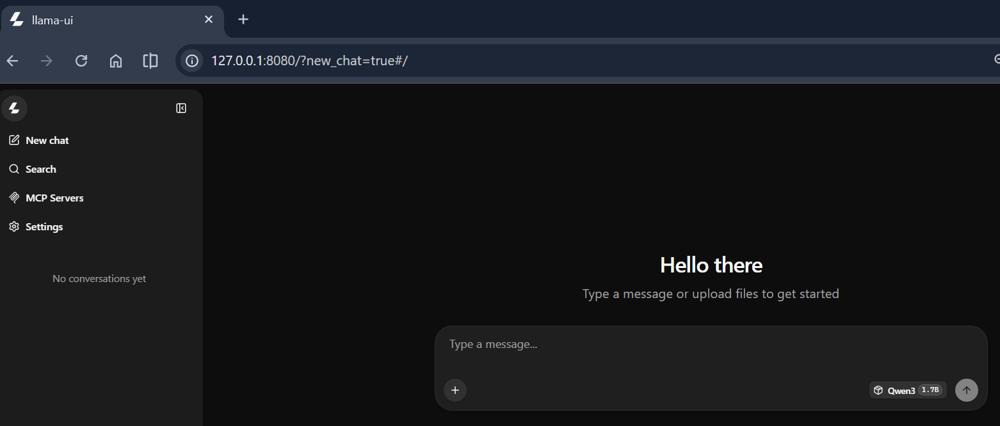
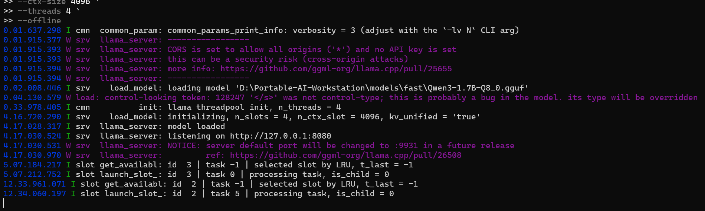
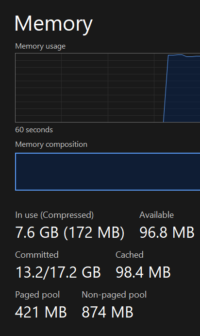
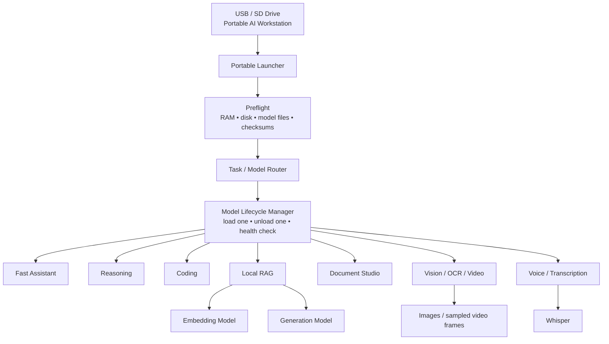

# Portable Offline AI Workstation

**A resource-aware architecture and working proof-of-concept for running private local AI from removable storage.**

> **Project status:** Core proof-of-concept validated. The multi-model workstation is fully designed, but the complete seven-mode system was not implemented on the original 8 GB test laptop because the machine ran out of practical working memory.



## Why I built this

I wanted to test a simple idea:

**Can a removable USB/SD drive carry the runtime, models, configuration, workspace and documentation needed to turn a Windows computer into an offline AI workstation?**

The target was bigger than a single chatbot. The full design includes seven local AI modes:

1. ⚡ Fast AI Assistant  
2. 🧠 Deep Reasoning  
3. 💻 Coding Assistant  
4. 📚 Local RAG / Document Research  
5. 📄 Document & Report Studio  
6. 👁 Vision / OCR / Screenshot / Video Analysis  
7. 🎙 Voice / Audio / Transcription  

The design also includes model switching, RAM checks, integrity verification, logging, benchmarking and local-only security controls.

## What I actually validated

This repository separates **tested work** from **planned architecture**.

| Area | Status | Evidence |
|---|---|---|
| 29.7 GB exFAT removable drive prepared | ✅ Tested | `P01`, `P02` |
| Portable project folder structure | ✅ Tested | `P03` |
| llama.cpp Windows CPU runtime | ✅ Tested | `P04` |
| Runtime version and SHA-256 check | ✅ Tested | `P04` |
| Qwen GGUF model loaded from removable storage | ✅ Tested | `P06`, `P07` |
| Local server at `127.0.0.1:8080` | ✅ Tested | `P06`, `P07` |
| llama.cpp browser UI | ✅ Tested | `P05` |
| Local inference started | ✅ Tested | `P08` |
| Real memory bottleneck captured | ✅ Tested | `P09` |
| Seven-mode AI workstation | 🧭 Designed | Architecture docs |
| Local RAG, coding, vision, voice, document modules | 🧭 Designed | Architecture docs |
| Automatic model lifecycle/router | 🧭 Designed | `docs/06-model-switching.md` |

## Proof-of-concept stack

- **Experiment date:** 15 August 2026
- **Host OS:** Windows
- **CPU:** Intel Core i5-1135G7, 4 cores / 8 logical processors
- **RAM:** 8 GB LPDDR4
- **GPU:** Intel Iris Xe integrated graphics
- **Removable storage:** 29.7 GB usable, exFAT
- **Inference runtime:** llama.cpp
- **Tested runtime build:** `10437` (`0.1.0-dev`, commit `16d222fc5`)
- **Tested model:** `Qwen3-1.7B-Q8_0.gguf`
- **Server:** local loopback, `127.0.0.1:8080`

## The important result

The prototype **did work**:

- the runtime launched,
- the GGUF model loaded,
- the local server started,
- the browser UI opened,
- and inference began.

The limiting factor was not basic compatibility. It was **resource pressure**.



During the first run, llama.cpp automatically created multiple server slots while the model used a 4096-token context. The laptop was already memory-constrained before inference. Under load, available RAM fell to roughly **96.8 MB**, Windows paging increased heavily, and generation slowed to about **0.01 token/s** in the captured run.



That changed the project from “run a model from a USB” into a more useful engineering problem:

> **How should a portable AI workstation choose models, context sizes and concurrency so it stays inside the resources of the host computer?**

## Architecture



The key design rule is simple:

**Do not keep every model in RAM. Load only the model needed for the current task.**

Modern llama.cpp also has a router mode that can dynamically load and unload models. For a low-memory workstation, the design can cap the number of simultaneously loaded models at one.

See [Model Switching](docs/06-model-switching.md).

## Seven-mode design

| Mode | Purpose | Reference model/tool |
|---|---|---|
| ⚡ Fast | chat, rewrite, summarize, notes | Qwen3 1.7B or a smaller replacement |
| 🧠 Reasoning | planning, logic, analysis | Qwen3 4B Q4_K_M |
| 💻 Coding | explain, generate, debug code | Qwen2.5-Coder 3B Q4_K_M |
| 📚 Local RAG | search and answer from local documents | Qwen3 Embedding 0.6B + generation model |
| 📄 Documents | Markdown, HTML, DOCX, PDF | local LLM + Pandoc/Typst |
| 👁 Vision | screenshots, OCR, scans, video frames | Qwen3-VL 2B Q4_K_M + mmproj |
| 🎙 Voice | transcription and audio analysis | whisper.cpp + local LLM |

These are **reference choices**, not permanent requirements. The workstation should allow models to be replaced as better small GGUF models become available.

## Resource-aware design

The original experiment taught one clear lesson:

**Model file size is not the same as total runtime memory use.**

A real local deployment also needs memory for:

- Windows and background services,
- model weights,
- KV cache,
- context,
- server slots,
- browser/UI,
- runtime buffers,
- and shared memory used by an integrated GPU.

Planning guide:

| Host RAM | Practical expectation |
|---|---|
| 8 GB | proof-of-concept, very small models, aggressive tuning |
| 16 GB | practical target for this small-model workstation design |
| 24–32 GB | much more comfortable local multi-workflow environment |

These are planning ranges, not fixed hardware requirements.

The workstation should run a preflight before starting a model, reduce context on low-memory hosts, keep `--parallel 1` for single-user use, and unload idle models.

See [Resource Engineering](docs/05-resource-engineering.md).

## Privacy and security

Local inference removes the need to send prompts to a cloud AI API, but **local does not automatically mean secure**.

The initial llama.cpp console warned that CORS allowed all origins and no API key was configured. That warning is about the local web server, not the GGUF model secretly sending prompts anywhere.

The hardened design uses:

```text
--host 127.0.0.1
--cors-origins localhost
--offline
--parallel 1
```

An API key can also be added as defence in depth, especially if another application talks to the local API.

The project does **not** enable llama.cpp shell/file tools by default. Giving a model permission to execute commands is a separate security decision from running inference.

See [Privacy and Security](docs/10-privacy-and-security.md) and [`SECURITY.md`](SECURITY.md).

## Reproduce the tested prototype

The original model file and runtime binaries are intentionally **not stored in this repository**.

Expected removable-drive layout:

```text
Portable-AI-Workstation/
├── runtime/
│   └── llama-cpp/
│       └── cpu/
│           └── llama-server.exe
└── models/
    └── fast/
        └── Qwen3-1.7B-Q8_0.gguf
```

Tested baseline command:

```powershell
cd "D:\Portable-AI-Workstation\runtime\llama-cpp\cpu"

.\llama-server.exe `
  -m "D:\Portable-AI-Workstation\models\fast\Qwen3-1.7B-Q8_0.gguf" `
  --host 127.0.0.1 `
  --port 8080 `
  --ctx-size 4096 `
  --threads 4 `
  --offline
```

That baseline loaded successfully, but it was too memory-heavy for the test host.

The next configuration reduced context and forced one server slot:

```powershell
.\llama-server.exe `
  -m "D:\Portable-AI-Workstation\models\fast\Qwen3-1.7B-Q8_0.gguf" `
  --host 127.0.0.1 `
  --port 8080 `
  --ctx-size 2048 `
  --parallel 1 `
  --threads 4 `
  --offline
```

For a future hardened run, also restrict CORS:

```text
--cors-origins localhost
```

Full commands and observations are in [Prototype Commands](prototype/commands-used.md).

## Repository map

```text
.
├── README.md
├── SECURITY.md
├── THIRD_PARTY_NOTICES.md
├── docs/              # case-study chapters
├── architecture/      # Mermaid architecture diagrams
├── evidence/          # screenshots from the real experiment
├── scripts/           # reference PowerShell automation
├── config/            # model and router examples
└── prototype/         # exact tested setup and findings
```

## What I learned

1. **A model loading successfully does not mean the host has enough memory for useful inference.**
2. **Context size and server parallelism are resource decisions, not just quality settings.**
3. **Portable paths matter.** Hard-coding `D:\` is fragile because Windows can change removable-drive letters.
4. **One model at a time is the right default for a low-resource multi-model workstation.**
5. **Local inference improves privacy, but the HTTP server still needs normal security hardening.**
6. **A failed performance target can still produce a successful engineering proof-of-concept** when the bottleneck is measured, explained and converted into a better design.

## Continue the project

Start here:

- [Project Overview](docs/01-project-overview.md)
- [Proof of Concept](docs/02-proof-of-concept.md)
- [System Architecture](docs/03-system-architecture.md)
- [Model Strategy](docs/04-model-strategy.md)
- [Resource Engineering](docs/05-resource-engineering.md)
- [Model Switching](docs/06-model-switching.md)
- [Local RAG Design](docs/07-local-rag-design.md)
- [Vision, OCR & Video](docs/08-vision-ocr-video.md)
- [Documents & Voice](docs/09-document-and-voice.md)
- [Privacy & Security](docs/10-privacy-and-security.md)
- [Implementation Roadmap](docs/11-implementation-roadmap.md)
- [Troubleshooting](docs/12-troubleshooting.md)
- [Lessons Learned](docs/13-lessons-learned.md)
- [Technical Sources](docs/14-sources.md)

---

**Scope note:** This repository documents a real prototype plus a reusable architecture. It does not claim that the full seven-mode workstation was completed on the original 8 GB machine.
