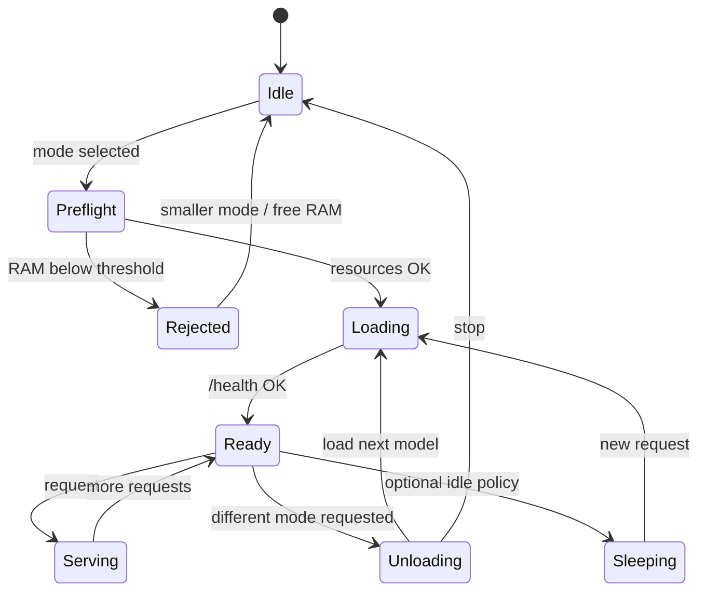

# Model Routing


```mermaid
stateDiagram-v2
    [*] --> Idle
    Idle --> Preflight: mode selected
    Preflight --> Rejected: RAM below threshold
    Rejected --> Idle: smaller mode / free RAM
    Preflight --> Loading: resources OK
    Loading --> Ready: /health OK
    Ready --> Serving: request
    Serving --> Ready: more requests
    Ready --> Unloading: different mode requested
    Unloading --> Loading: load next model
    Ready --> Sleeping: optional idle policy
    Sleeping --> Loading: new request
    Unloading --> Idle: stop
```

Recommended low-memory policy:

```text
models-max = 1
parallel = 1
```
