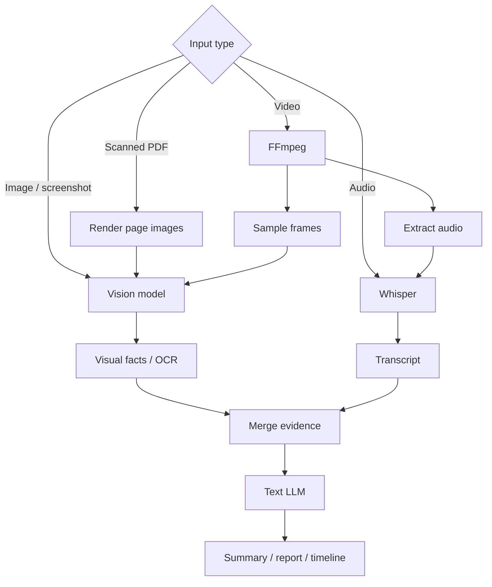

# Multimodal Pipeline

```mermaid
flowchart TD
    Input{"Input type"}
    Input -->|Image / screenshot| Vision["Vision model"]
    Input -->|Scanned PDF| Pages["Render page images"]
    Pages --> Vision
    Input -->|Audio| Whisper["Whisper"]
    Input -->|Video| FF["FFmpeg"]
    FF --> Frames["Sample frames"]
    FF --> Audio["Extract audio"]
    Frames --> Vision
    Audio --> Whisper
    Vision --> Facts["Visual facts / OCR"]
    Whisper --> Transcript["Transcript"]
    Facts --> Merge["Merge evidence"]
    Transcript --> Merge
    Merge --> Text["Text LLM"]
    Text --> Output["Summary / report / timeline"]
```
