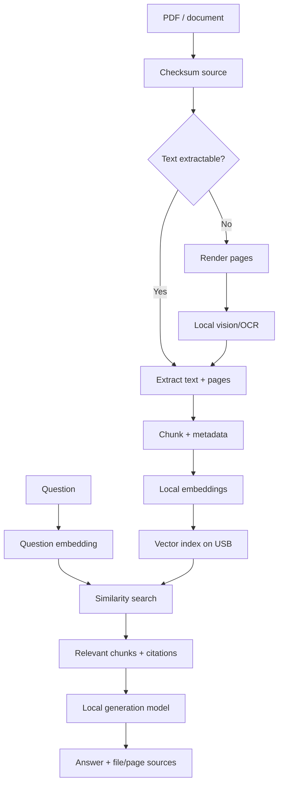

# Local RAG Pipeline

```mermaid
flowchart TD
    PDF["PDF / document"] --> Hash["Checksum source"]
    Hash --> Text{"Text extractable?"}
    Text -->|Yes| Parse["Extract text + pages"]
    Text -->|No| Img["Render pages"]
    Img --> OCR["Local vision/OCR"]
    OCR --> Parse
    Parse --> Chunk["Chunk + metadata"]
    Chunk --> Embed["Local embeddings"]
    Embed --> Store["Vector index on USB"]

    Ask["Question"] --> QEmbed["Question embedding"]
    QEmbed --> Search["Similarity search"]
    Store --> Search
    Search --> Pack["Relevant chunks + citations"]
    Pack --> Gen["Local generation model"]
    Gen --> Ans["Answer + file/page sources"]
```
