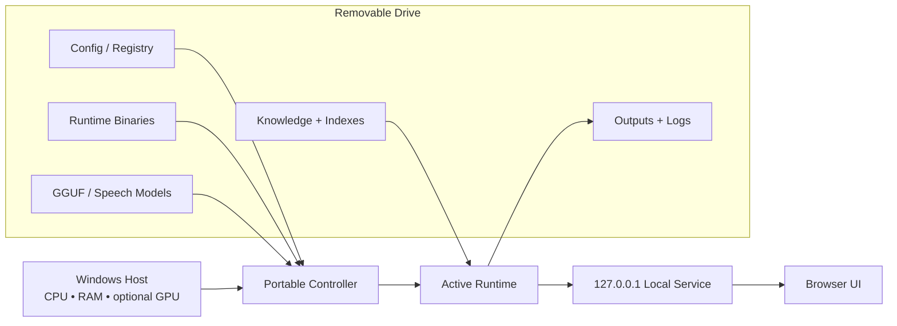

# Workstation Architecture

```mermaid
flowchart LR
    subgraph USB["Removable Drive"]
        Config["Config / Registry"]
        Runtime["Runtime Binaries"]
        Models["GGUF / Speech Models"]
        Knowledge["Knowledge + Indexes"]
        Output["Outputs + Logs"]
    end

    Host["Windows Host<br/>CPU • RAM • optional GPU"] --> Control["Portable Controller"]
    Config --> Control
    Runtime --> Control
    Models --> Control
    Control --> Engine["Active Runtime"]
    Engine --> Local["127.0.0.1 Local Service"]
    Local --> Browser["Browser UI"]
    Knowledge --> Engine
    Engine --> Output
```

The drive carries software assets. The host provides compute.

The model is loaded **from** removable storage and executed by the host CPU/GPU/RAM.
