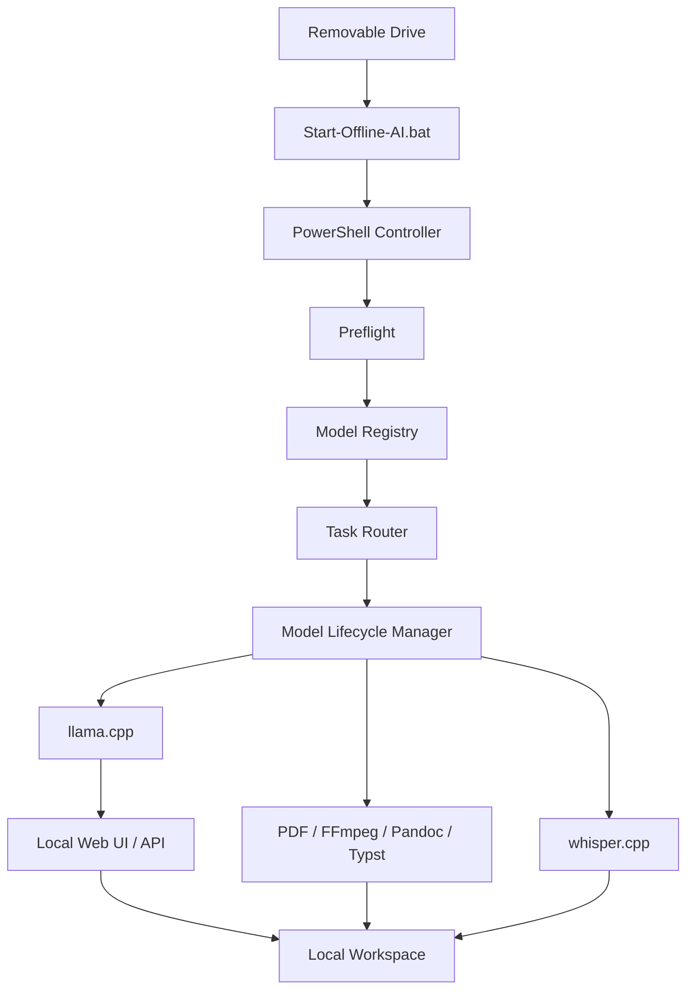

# 03 — System Architecture

## Design principle

The workstation is a **portable control plane around local AI runtimes**.

The removable drive stores:

- runtime binaries,
- model files,
- configuration,
- local documents,
- indexes,
- outputs,
- logs,
- project metadata.

The host contributes:

- CPU,
- RAM,
- optional GPU acceleration,
- operating system,
- browser.

## High-level architecture



## Original portable folder model

```text
Portable-AI-Workstation/
│
├── Start-Offline-AI.bat
├── config/
├── runtime/
│   ├── llama-cpp/
│   ├── llamafile/
│   ├── whisper-cpp/
│   ├── ffmpeg/
│   ├── mupdf/
│   ├── pandoc/
│   └── typst/
├── models/
│   ├── fast/
│   ├── reasoning/
│   ├── coding/
│   ├── vision/
│   ├── embeddings/
│   └── speech/
├── knowledge/
├── workspace/
├── logs/
└── docs/
```

## Avoid hard-coded drive letters

The development drive happened to be `D:`.

That must **not** become an architectural requirement.

Use the script location as the root:

```batch
%~dp0
```

or in PowerShell:

```powershell
$Root = Split-Path -Parent $PSScriptRoot
```

That keeps paths portable when Windows changes the removable-drive letter.

## Service boundaries

### Inference service
llama.cpp serves text and multimodal GGUF models.

### Speech service
whisper.cpp handles speech-to-text.

### Document service
MuPDF extracts text or renders scanned pages. Pandoc/Typst convert generated Markdown into final document formats.

### Knowledge service
The RAG module stores extracted text, chunks, embeddings and source metadata on the removable drive.

### Controller
The controller decides:

- which mode the user requested,
- whether the host has enough free RAM,
- which runtime/model is required,
- whether another model should be unloaded,
- where outputs should be stored,
- and what should be logged.

## One-model rule

The low-memory design uses:

```text
maximum loaded heavy models = 1
```

This is a deliberate resource policy.

## Failure behaviour

A good portable workstation should fail safely.

Examples:

- model missing → show the expected path,
- runtime missing → show setup instructions,
- RAM below threshold → refuse or offer a smaller profile,
- port already in use → choose another port or stop,
- checksum mismatch → block the asset,
- scanned PDF → fall back to vision/OCR,
- no internet → continue normal local inference.

The architecture should make failures visible instead of letting the host silently freeze.
