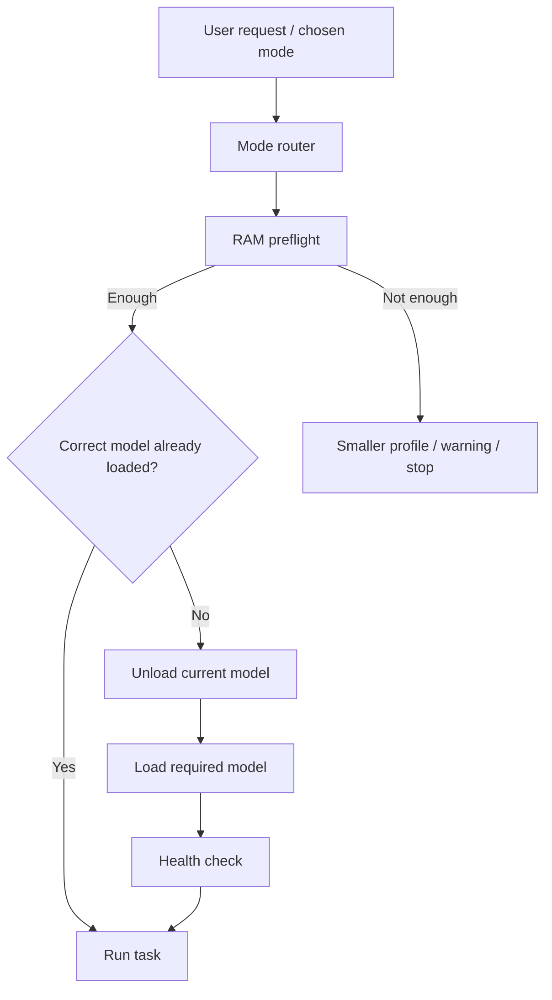

# 06 — Model Switching

## Goal

The user should choose a task, not manually rebuild a llama.cpp command every time.

```text
[1] Fast Assistant
[2] Deep Reasoning
[3] Coding
[4] Research Documents
[5] Document Studio
[6] Vision / OCR / Video
[7] Voice / Audio
```

The controller decides what must run.

## Routing logic



## Option A — PowerShell lifecycle manager

The controller:

1. stops the current model process,
2. waits for memory to be released,
3. launches the new model with its saved profile,
4. waits for `/health`,
5. opens or reuses the local UI.

## Option B — llama.cpp router mode

Current llama.cpp supports a router mode that can dynamically load and unload models and route requests by model name.

A future implementation can use:

```text
--models-preset
--models-max 1
--models-autoload
```

`--models-max 1` matches the core workstation rule: keep at most one heavy model loaded.

Model presets can store different context/runtime parameters for each model.

This repository includes:

- `config/models-router.example.ini`
- `scripts/start-router.ps1`

These are reference designs, not proof-of-concept-tested modules.

## Low-memory behaviour

Each model profile should store:

- minimum free RAM,
- preferred context,
- minimum context,
- slots,
- CPU threads,
- optional GPU backend,
- optional multimodal projector.

Example:

```text
User chooses Reasoning
        ↓
Available RAM = 3.1 GB
        ↓
Reasoning profile wants 5.0 GB free
        ↓
Do NOT load it
        ↓
Offer smaller profile or retry after freeing RAM
```

## RAG uses models at different times

```text
Ingest document
    ↓
Embedding model
    ↓
Save vectors
    ↓
Unload embedding model

Question
    ↓
Search saved vectors
    ↓
Load generation model
    ↓
Answer with sources
```

## Vision and speech use the same lifecycle idea

Vision:

```text
load vision → analyze → save extracted text → unload
```

Speech:

```text
run Whisper → save transcript → stop Whisper → load text model → summarize
```

This is how the workstation behaves like a larger AI product without keeping every model in memory.
