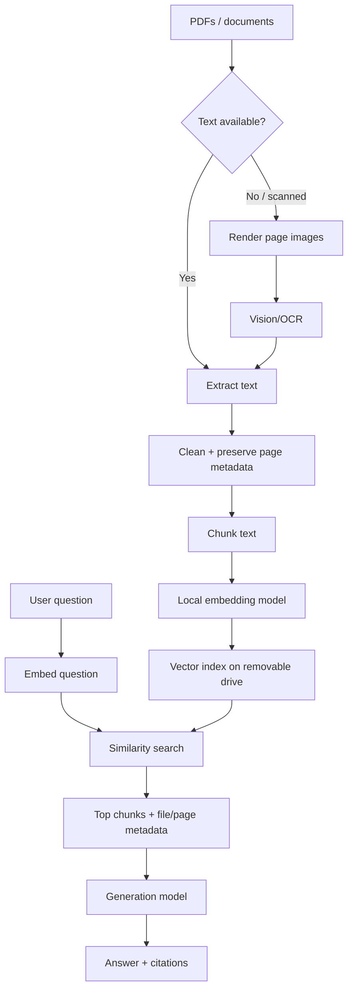

# 07 — Local RAG Design

## Goal

Ask questions about local documents without sending those documents to a cloud AI service.

## Pipeline



## Ingestion happens once

Store:

```text
knowledge/
├── inbox/
├── extracted/
├── page-images/
└── indexes/
```

For each source document, keep:

- original file name,
- checksum,
- page number,
- extracted text,
- chunk ID,
- embedding/vector ID.

If the source file changes, rebuild its index.

## Text PDF vs scanned PDF

### Text PDF
Use a PDF tool such as MuPDF to extract text directly.

### Scanned PDF
Render the page to an image, then send it to the vision/OCR model.

Do not spend AI compute on pages that already contain machine-readable text.

## Chunking

Start simple:

```text
chunk size: 500–900 tokens
overlap: 50–120 tokens
metadata: file + page + chunk id
```

Tune after measuring retrieval quality.

## Retrieval

1. embed the question,
2. search the local vector index,
3. return top relevant chunks,
4. merge duplicates,
5. pass only useful context to the generation model.

## Answer format

```text
Answer:
...

Sources:
- AWS_Security.pdf — page 31
- AWS_Security.pdf — page 34
- Cloud_Guide.pdf — page 76
```

## Resource-aware sequence

```text
embedding phase
    ↓
save vectors
    ↓
unload embedding model
    ↓
load generation model only when needed
```

## Privacy boundary

RAG is local only if every stage is local:

- extraction,
- OCR,
- embeddings,
- vector search,
- generation.

An offline mode must not silently call a hosted embedding API.
