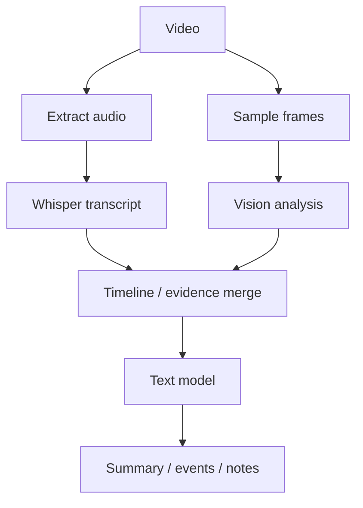

# 08 — Vision, OCR & Video

## Vision mode

The reference multimodal choice is Qwen3-VL-2B-Instruct GGUF.

Its official GGUF repository provides a Q4_K_M language model plus a separate multimodal projector (`mmproj`) and documents llama.cpp compatibility.

## Screenshot analysis

Use cases:

- explain an error screenshot,
- read a chart,
- inspect a UI,
- extract visible text,
- summarize a dashboard,
- read a photographed document.

```text
image
  ↓
vision model + mmproj
  ↓
description / OCR / structured answer
```

## Scanned documents

```text
PDF
  ↓
render page image
  ↓
vision model
  ↓
text + layout information
  ↓
save text with page number
```

Do not OCR every PDF by default. First check whether text extraction already works.

## Video

Use a staged pipeline:



## Frame sampling

Possible policies:

- one frame every 5–30 seconds,
- scene-change detection,
- denser frames near transcript keywords,
- user-selected time range.

## Why separate audio and visual evidence

A frame may show information the transcript does not contain.

The transcript may contain information no sampled frame shows.

Combining both gives a stronger result without keeping a whole long video in model context.

## Resource control

Vision inputs can expand memory use quickly.

Control:

- image resolution,
- images per request,
- visual token budget,
- frame sampling rate,
- context size.

On low-memory hosts, save intermediate OCR/transcript text to disk and let a smaller text model handle the final summary.
